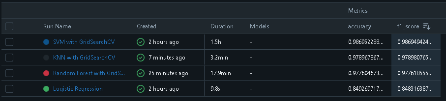
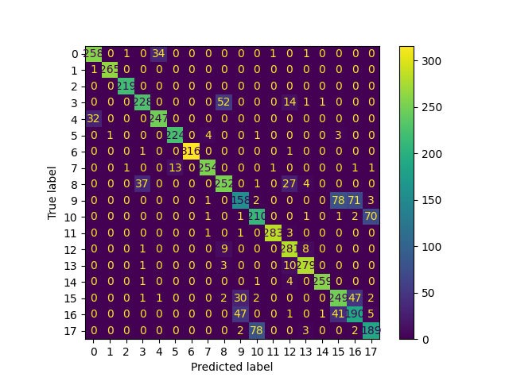
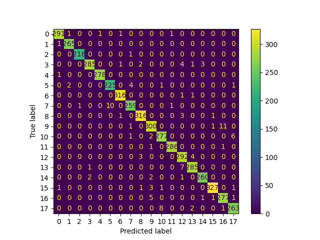
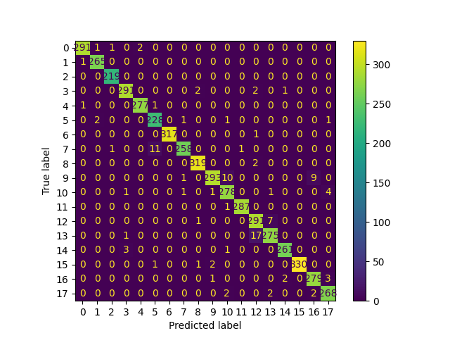

# Hand Landmarks Prediction Project

This project predicts hand gestures using machine learning models trained on hand landmarks data. It compares multiple models, selects the best based on evaluation metrics, and tracks experiments using MLflow.

---

## Project Overview

This repository includes:

* **Data Preprocessing**: Preparing the dataset for training and testing.
* **Model Training**: Training various machine learning models including Logistic Regression, SVM, KNN, and Random Forest.
* **Model Evaluation**: Evaluating models using metrics like accuracy, precision, recall, and F1-score.
* **Experiment Tracking**: Using MLflow to log parameters, metrics, and models.
* **Best Model Selection**: SVM was chosen as the best model based on its superior performance metrics.

---

## Prerequisites

### Install Required Libraries

Run the following command to install the required libraries:

```bash
pip install -r requirements.txt
```

### Required Python Libraries

* pandas
* numpy
* scikit-learn
* matplotlib
* mlflow
* joblib

---

## Dataset

The dataset (`DataSet/hand_landmarks_data.csv`) contains hand landmarks and their corresponding gesture labels. It is used for training and testing the models.

---

## Model Training and Evaluation

### Models Used

1. **Logistic Regression**
2. **Support Vector Machine (SVM)**
3. **K-Nearest Neighbors (KNN)**
4. **Random Forest**

### Model Performance

Each model was evaluated using multiple metrics and their confusion matrices were generated:

#### Model Comparison


#### Confusion Matrices






#### Results Summary


**Selected Model**: SVM was chosen for its superior performance in terms of both accuracy and F1 score.

---

## How to Run

1. Clone the repository:

   ```bash
   git clone <repository_url>
   cd <repository_directory>
   ```

2. Install dependencies:

   ```bash
   pip install -r requirements.txt
   ```

3. Preprocess the data:

   The preprocessing is handled in the `preprocessing.py` script.

4. Train the models:

   Use the `train.py` script to train the models. MLflow will automatically log results.

   ```bash
   python train.py
   ```

5. Track Experiments:

   Start the MLflow server:

   ```bash
   mlflow ui
   ```

   Navigate to `http://localhost:5000` to view experiment results.

---

## Project Structure

* `DataSet/hand_landmarks_data.csv`: Dataset for training and testing
* `preprocessing.py`: Data preprocessing script
* `train.py`: Model training and evaluation script
* `app.py`: Application interface
* `requirements.txt`: Python library dependencies
* `confusion_matrix_*.png`: Confusion matrices for each model
* `models_comapre.png`: Model comparison visualization

---

## Experiment Tracking with MLflow

The project uses MLflow for:

* Logging model parameters and metrics
* Saving trained models
* Comparing model performance

To view experiment results:

1. Start the MLflow server with:

   ```bash
   mlflow ui
   ```

2. Open your browser and go to `http://localhost:5000`

---

## Future Work

* Add deep learning models for better accuracy
* Implement real-time hand gesture recognition using a webcam
* Integrate the system into a web or mobile application
* Add more gesture classes to the dataset
* Implement model interpretability techniques

---

## License

This project is licensed under the MIT License. See the `LICENSE` file for details.

---

